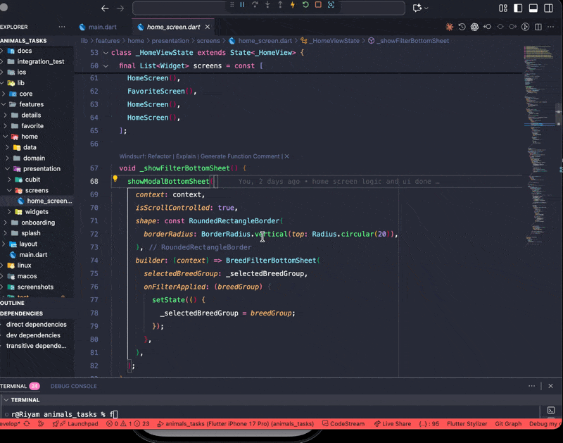
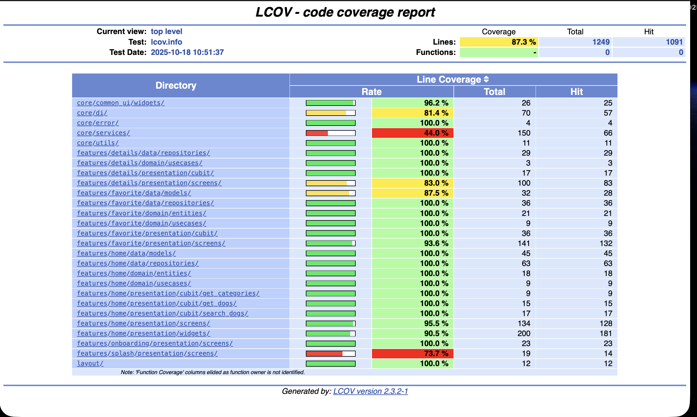

<div align="center">

# 🐾 Find Your Paw Mate

### A Modern Flutter Pet Adoption Application

[](https://codecov.io/gh/riyam224/-find_your_paw_mate)
[](https://flutter.dev)
[](https://dart.dev)
[](LICENSE)
[](test/)
[](https://app.codecov.io/gh/riyam224/-find_your_paw_mate)

**A production-ready Flutter application for browsing dog and cat breeds with favorites functionality, built using Clean Architecture principles, BLoC pattern, and comprehensive test coverage.**

[Features](#-features) • [Demo](#-demo--test-reports) • [Architecture](#-architecture) • [Testing](#-testing-coverage) • [Getting Started](#-getting-started) • [API Integration](#-api-integration)

</div>

---

## 📋 Table of Contents

- [Overview](#-overview)
- [Demo & Test Reports](#-demo--test-reports)
- [Features](#-features)
- [Architecture](#-architecture)
- [UI Screens](#-ui-screens)
- [Logic Implementation](#-logic-implementation)
- [API Integration](#-api-integration)
- [Testing Coverage](#-testing-coverage)
- [Project Structure](#-project-structure)
- [Getting Started](#-getting-started)
- [Dependencies](#-dependencies)
- [Development Practices](#-development-practices)

---

## 🎯 Overview

**Find Your Paw Mate** is a comprehensive mobile application that connects pet lovers with their perfect companions. Built with industry best practices and modern Flutter architecture, this app showcases:

### Core Capabilities

- 🔍 **Browse & Search** - Explore dog and cat breeds with real-time search
- ❤️ **Favorites Management** - Save and manage your favorite pets
- 📊 **Advanced Filtering** - Filter by categories and breed groups
- 📱 **Intuitive Navigation** - Seamless user experience with smooth transitions
- 🌐 **Dual API Integration** - Leveraging The Dog API and The Cat API

### Technical Highlights

| Aspect | Implementation |
|--------|----------------|
| 🏗️ **Architecture** | Clean Architecture with 3-layer separation |
| 🔄 **State Management** | BLoC Pattern with 5 dedicated Cubits |
| 🧪 **Testing** | 200+ test cases across 39 test files |
| 📊 **Coverage** | 87.3% (Goal: 90%+) |
| 🌐 **APIs** | Dual integration (Dog API + Cat API) |
| 📱 **UI/UX** | Material Design 3 with custom widgets |
| ⚡ **Performance** | Image caching, debouncing, lazy loading |

---

## 📸 Demo & Test Reports

### App Walkthrough

<div align="center">



*Interactive demo showcasing browsing, searching, filtering, and favorites management*

</div>

### Test Coverage Report

<div align="center">



</div>

#### Coverage Metrics

| Metric | Value | Status |
|--------|-------|--------|
| **Total Test Files** | 39 | ✅ |
| **Total Test Cases** | 200+ | ✅ |
| **Overall Coverage** | 87.3% | 🟡 |
| **Coverage Goal** | 90%+ | 🎯 |
| **CI/CD Integration** | Codecov + GitHub Actions | ✅ |

📊 **[View Detailed Coverage Report on Codecov](https://app.codecov.io/gh/riyam224/-find_your_paw_mate)**

---

## ✨ Features

### 🏠 Home Screen Features

<table>
<tr>
<td width="50%">

**Browsing & Display**
- ✅ Grid view of dog/cat breeds
- ✅ High-quality images with caching
- ✅ Pet information cards
- ✅ Pagination support
- ✅ Pull-to-refresh functionality

</td>
<td width="50%">

**Search & Filtering**
- ✅ Real-time breed search
- ✅ 500ms debouncing for performance
- ✅ Category filtering chips
- ✅ Breed group filter (bottom sheet)
- ✅ Empty state handling

</td>
</tr>
</table>

### ❤️ Favorites Features

- ✅ Add/remove favorites with visual feedback
- ✅ Persistent storage via API
- ✅ Category-based filtering
- ✅ Relative timestamps ("Added 2d ago")
- ✅ Grid view with 2 columns
- ✅ Confirmation dialogs for removal

### 📋 Details Screen Features

- ✅ Large hero images with zoom capability
- ✅ Comprehensive breed information
- ✅ Temperature-colored info tiles
- ✅ Gender, age, and weight display
- ✅ Temperament and description
- ✅ Breed group and lifespan
- ✅ Favorite toggle in app bar
- ✅ "Adopt me" call-to-action

### 🎨 UI/UX Features

- ✅ Splash screen with branding
- ✅ Onboarding for new users
- ✅ Bottom navigation
- ✅ Shimmer loading effects
- ✅ Error states with retry options
- ✅ Responsive design
- ✅ Custom animations and transitions

---

## 🏗️ Architecture

This project implements **Clean Architecture** principles with strict layer separation:

```
┌─────────────────────────────────────────────────┐
│           PRESENTATION LAYER                    │
│  • UI Screens & Widgets                         │
│  • BLoC/Cubit State Management                  │
│  • State Classes                                │
└───────────────┬─────────────────────────────────┘
                │ depends on ↓
┌───────────────▼─────────────────────────────────┐
│           DOMAIN LAYER                          │
│  • Business Entities                            │
│  • Use Cases (Business Logic)                   │
│  • Repository Interfaces                        │
└───────────────┬─────────────────────────────────┘
                │ depends on ↓
┌───────────────▼─────────────────────────────────┐
│           DATA LAYER                            │
│  • Models & DTOs                                │
│  • Repository Implementations                   │
│  • API Services & Data Sources                  │
└─────────────────────────────────────────────────┘
```

### Layer Responsibilities

#### 🎨 Presentation Layer
**Location:** `lib/features/*/presentation/`

- **Screens** - UI pages (Home, Favorites, Details, Splash, Onboarding)
- **Widgets** - Reusable UI components (PetCard, SearchBar, CategoryChip)
- **Cubits** - State management with BLoC pattern
- **States** - State classes for each feature

#### 🎯 Domain Layer
**Location:** `lib/features/*/domain/`

- **Entities** - Pure business objects (DogEntity, FavoriteEntity, CategoryEntity)
- **Use Cases** - Business logic operations (GetDogsUseCase, AddFavoriteUseCase)
- **Repositories** - Abstract interfaces defining contracts

#### 💾 Data Layer
**Location:** `lib/features/*/data/`

- **Models** - Data transfer objects with JSON serialization
- **Repository Implementations** - Concrete implementations of domain repositories
- **API Services** - Network calls, error handling, and data mapping

### Architectural Benefits

✅ **Testability** - Each layer can be tested independently
✅ **Maintainability** - Changes in one layer don't affect others
✅ **Scalability** - Easy to add new features
✅ **Flexibility** - Can swap implementations (e.g., API → Local DB)
✅ **Dependency Rule** - Dependencies point inward only

---

## 📱 UI Screens

### 1️⃣ Splash Screen
**File:** [splash_screen.dart](lib/features/splash/presentation/screens/splash_screen.dart)

```
┌─────────────────────┐
│                     │
│       🐾 LOGO       │
│                     │
│   Find Your Paw     │
│        Mate         │
│                     │
└─────────────────────┘
```

**Features:**
- 3-second auto-navigation to Onboarding
- Centered logo and branding
- Timer-safe implementation for testing

---

### 2️⃣ Onboarding Screen
**File:** [onboarding_screen.dart](lib/features/onboarding/presentation/screens/onboarding_screen.dart)

**Components:**
- Welcome hero image
- Title: "Find Your Best Companion With Us"
- Descriptive subtitle about pet adoption
- "Get Started" button with pet icon
- Navigation to Home via GoRouter

---

### 3️⃣ Home Screen
**File:** [home_screen.dart](lib/features/home/presentation/screens/home_screen.dart)

**Layout:**
```
┌───────────────────────────────────┐
│  Search Bar [🔍]                  │
├───────────────────────────────────┤
│  [Cute] [Funny] [Active] ...     │ ← Category Chips
├───────────────────────────────────┤
│  ┌──────┐  ┌──────┐              │
│  │ Dog  │  │ Cat  │              │
│  │ Card │  │ Card │              │ ← Pet Grid
│  └──────┘  └──────┘              │
│  ┌──────┐  ┌──────┐              │
│  │ ...  │  │ ...  │              │
│  └──────┘  └──────┘              │
├───────────────────────────────────┤
│  [Home] [Favorites]               │ ← Bottom Nav
└───────────────────────────────────┘
```

**State Management (3 Cubits):**

| Cubit | Purpose | States |
|-------|---------|--------|
| `GetDogsCubit` | Fetch dogs/cats | Initial → Loading → Loaded/Error |
| `SearchDogsCubit` | Real-time search | Initial → Loading → Loaded/Empty/Error |
| `GetCategoriesCubit` | Manage categories | Initial → Loading → Loaded/Error |

**Features:**
- 🔍 Search with 500ms debounce
- 🏷️ Horizontal category scrolling
- 📊 Breed group filter (bottom sheet)
- 🔄 Pull-to-refresh
- ⏳ Shimmer loading effects
- 📄 Pagination (configurable limit/page)

---

### 4️⃣ Details Screen
**File:** [details_screen.dart](lib/features/details/presentation/screens/details_screen.dart)

**Layout:**
```
┌───────────────────────────────────┐
│  ← Back              ❤️ Favorite  │
├───────────────────────────────────┤
│                                   │
│       Large Pet Image             │
│                                   │
├───────────────────────────────────┤
│  Pet Name                         │
│  Breed Group                      │
├───────────────────────────────────┤
│  [Gender] [Age] [Weight]          │ ← Info Tiles
├───────────────────────────────────┤
│  About                            │
│  Description/Temperament text...  │
├───────────────────────────────────┤
│        [Adopt Me]                 │ ← CTA Button
└───────────────────────────────────┘
```

**State Management:**
- `GetDogDetailsCubit` - Fetch individual pet details

**Features:**
- 🖼️ Hero image with loading/error states
- 📊 Temperature-colored info tiles (teal)
- ❤️ Favorite toggle in AppBar
- 🔄 Error retry button
- 📱 Full-screen loading state

---

### 5️⃣ Favorites Screen
**File:** [favorite_screen.dart](lib/features/favorite/presentation/screens/favorite_screen.dart)

**Layout:**
```
┌───────────────────────────────────┐
│  Your Favorite Pets               │
├───────────────────────────────────┤
│  [All] [Cute] [Funny] ...         │ ← Filter Chips
├───────────────────────────────────┤
│  ┌──────────┐  ┌──────────┐      │
│  │ Image  X │  │ Image  X │      │ ← 2-column grid
│  │ Name     │  │ Name     │      │
│  │ Breed    │  │ Breed    │      │
│  │ Added 2d │  │ Added 1w │      │
│  └──────────┘  └──────────┘      │
└───────────────────────────────────┘
```

**State Management:**
- `FavoriteCubit` - Get/Add/Remove favorites

**Features:**
- ✅ Remove button (X) with confirmation
- 🕒 Relative timestamps
- 🏷️ Category filtering
- 💬 SnackBar feedback
- 📭 Empty state with heart icon

---

### Custom Widgets

#### PetCard
**File:** [pet_card.dart](lib/features/home/presentation/widgets/pet_card.dart)

- Cached network image with placeholder
- Pet name, breed, distance
- Favorite toggle button
- Tap to navigate to details

#### SearchBarWidget
**File:** [search_bar_widget.dart](lib/features/home/presentation/widgets/search_bar_widget.dart)

- Debounced search (500ms)
- Clear button (X icon)
- Real-time callback trigger

#### CategoryChip
**File:** [category_chip.dart](lib/features/home/presentation/widgets/category_chip.dart)

- Active/inactive visual states
- Tap to select/deselect
- Custom styling

#### BreedFilterBottomSheet
**File:** [breed_filter_bottom_sheet.dart](lib/features/home/presentation/widgets/breed_filter_bottom_sheet.dart)

- Modal bottom sheet for breed groups
- Radio selection with visual feedback
- Apply/Cancel actions

---

## ⚙️ Logic Implementation

### State Management: BLoC/Cubit Pattern

The app uses **5 specialized Cubits** for clean separation of concerns:

#### 1️⃣ GetDogsCubit
**File:** [get_dogs_cubit.dart](lib/features/home/presentation/cubit/get_dogs_cubit.dart)

```dart
class GetDogsCubit extends Cubit<GetDogsState> {
  final GetDogsUseCase getDogsUseCase;

  Future<void> fetchDogs({int limit = 10, int page = 0}) async {
    emit(GetDogsLoading());

    final result = await getDogsUseCase(limit: limit, page: page);

    result.fold(
      (failure) => emit(GetDogsError(failure.message)),
      (dogs) => emit(GetDogsLoaded(dogs)),
    );
  }
}
```

**Purpose:** Fetch paginated dog/cat lists
**Methods:** `fetchDogs()`, `fetchCatsByCategory()`
**States:** Initial → Loading → Loaded/Error

---

#### 2️⃣ SearchDogsCubit
**File:** [search_dogs_cubit.dart](lib/features/home/presentation/cubit/search_dogs_cubit.dart)

**Purpose:** Handle real-time breed search
**Methods:** `searchDogs()`, `clearSearch()`
**States:** Initial → Loading → Loaded/Empty/Error
**Feature:** 500ms debouncing for API efficiency

---

#### 3️⃣ GetCategoriesCubit
**File:** [get_categories_cubit.dart](lib/features/home/presentation/cubit/get_categories_cubit.dart)

**Purpose:** Manage pet categories
**Methods:** `fetchCategories()`
**States:** Initial → Loading → Loaded/Error

---

#### 4️⃣ GetDogDetailsCubit
**File:** [get_dog_details_cubit.dart](lib/features/details/presentation/cubit/get_dog_details_cubit.dart)

**Purpose:** Fetch individual pet details
**Methods:** `fetchDogDetails(dogId)`
**States:** Initial → Loading → Loaded/Error

---

#### 5️⃣ FavoriteCubit
**File:** [favorite_cubit.dart](lib/features/favorite/presentation/cubit/favorite_cubit.dart)

**Purpose:** Manage all favorites operations
**Methods:**
- `getFavorites()` - Fetch user favorites
- `addFavorite(imageId, subId)` - Add to favorites
- `removeFavorite(favoriteId)` - Remove from favorites

**States:** Initial → Loading → Loaded/Added/Removed/Error

---

### Use Cases (Domain Layer)

**7 Use Cases implementing functional programming with Dartz:**

| # | Use Case | File | Purpose | Returns |
|---|----------|------|---------|---------|
| 1 | `GetDogsUseCase` | [get_dogs_usecase.dart](lib/features/home/domain/usecases/get_dogs_usecase.dart) | Fetch paginated dog list | `Either<Failure, List<DogEntity>>` |
| 2 | `SearchDogsUseCase` | [search_dogs_usecase.dart](lib/features/home/domain/usecases/search_dogs_usecase.dart) | Search dogs by breed name | `Either<Failure, List<DogEntity>>` |
| 3 | `GetCategoriesUseCase` | [get_categories_usecase.dart](lib/features/home/domain/usecases/get_categories_usecase.dart) | Fetch all categories | `Either<Failure, List<CategoryEntity>>` |
| 4 | `GetDogDetailsUseCase` | [get_dog_details_usecase.dart](lib/features/details/domain/usecases/get_dog_details_usecase.dart) | Fetch single pet details | `Either<Failure, DogEntity>` |
| 5 | `GetFavoritesUseCase` | [get_favorites_usecase.dart](lib/features/favorite/domain/usecases/get_favorites_usecase.dart) | Get all user favorites | `Either<Failure, List<FavoriteEntity>>` |
| 6 | `AddFavoriteUseCase` | [add_favorite_usecase.dart](lib/features/favorite/domain/usecases/add_favorite_usecase.dart) | Add pet to favorites | `Either<Failure, FavoriteEntity>` |
| 7 | `RemoveFavoriteUseCase` | [remove_favorite_usecase.dart](lib/features/favorite/domain/usecases/remove_favorite_usecase.dart) | Remove from favorites | `Either<Failure, Unit>` |

**Pattern:** All use cases return `Either<Failure, T>` from Dartz for functional error handling.

---

### Data Models & Entities

#### DogEntity (Domain Layer)
**File:** [dog_entity.dart](lib/features/home/domain/entities/dog_entity.dart)

```dart
class DogEntity extends Equatable {
  final String id;
  final String name;
  final String imageUrl;
  final String? imageId;
  final String? gender;
  final String? age;
  final String? weight;
  final String? distance;
  final String? lifeSpan;
  final String? breedGroup;
  final String? description;
  final bool isFavorite;
}
```

#### DogModel (Data Layer)
**File:** [dog_model.dart](lib/features/home/data/models/dog_model.dart)

- Extends `DogEntity`
- `fromJson()` factory for API parsing
- CDN URL construction from image ID
- Mock data for missing fields

#### FavoriteEntity (Domain Layer)
**File:** [favorite_entity.dart](lib/features/favorite/domain/entities/favorite_entity.dart)

```dart
class FavoriteEntity extends Equatable {
  final String id;
  final String imageId;
  final String imageUrl;
  final String? subId;
  final DateTime createdAt;
  final String? petName;
  final String? breedName;
  final String? breedId;
}
```

---

### Repository Pattern

#### Domain Interfaces (4)

| Repository | File | Methods |
|------------|------|---------|
| `DogRepository` | [dog_repository.dart](lib/features/home/domain/repositories/dog_repository.dart) | `getDogs()`, `searchDogs()` |
| `CategoryRepository` | [category_repository.dart](lib/features/home/domain/repositories/category_repository.dart) | `getCategories()` |
| `DogDetailsRepository` | [dog_details_repository.dart](lib/features/details/domain/repositories/dog_details_repository.dart) | `getDogDetails()` |
| `FavoriteRepository` | [favorite_repository.dart](lib/features/favorite/domain/repositories/favorite_repository.dart) | `getFavorites()`, `addFavorite()`, `removeFavorite()` |

#### Data Implementations (4)

All repository implementations:
- ✅ Catch `DioException` and map to domain `Failure` types
- ✅ Handle null/malformed data gracefully
- ✅ Return `Either<Failure, T>` for functional error handling
- ✅ Three failure types: `ServerFailure`, `NetworkFailure`, `UnknownFailure`

---

### Dependency Injection (GetIt)

**File:** [di.dart](lib/core/di/di.dart)

#### Registration Strategy

**Lazy Singletons:**
- `Dio` instance for Dog API
- `DogApiService` for Dog API
- Named `Dio` instance for Cat API (`catApiDio`)
- Named `DogApiService` for Cat API (`catApiService`)

**Factories (fresh instance per request):**
- All 5 Cubits
- All 7 Use Cases
- All 4 Repository Implementations

**Safety Features:**
- `_isDependenciesSetup` flag prevents double registration
- `isRegistered<T>()` checks before each registration

---

### Error Handling Framework

**File:** [failure.dart](lib/core/error/failure.dart)

```dart
abstract class Failure {
  final String message;
  const Failure(this.message);
}

class ServerFailure extends Failure {
  ServerFailure(String message) : super(message);
}

class NetworkFailure extends Failure {
  NetworkFailure(String message) : super(message);
}

class UnknownFailure extends Failure {
  UnknownFailure(String message) : super(message);
}
```

#### Error Flow Diagram

```
API Request
    ↓
DioException / Exception thrown
    ↓
Repository catches exception
    ↓
Maps to domain Failure
    ↓
UseCase returns Either<Failure, T>
    ↓
Cubit folds result
    ↓
Emits Error/Success state
    ↓
UI displays via BlocBuilder
```

---

## 🌐 API Integration

### Dual API Architecture

This app integrates with **two external APIs** for comprehensive pet data:

#### 🐕 The Dog API

**Base URL:** `https://api.thedogapi.com/v1/`
**Purpose:** Dog breeds, images, and search functionality

**Endpoints:**

| Method | Endpoint | Purpose | Parameters |
|--------|----------|---------|------------|
| GET | `/breeds` | Get all dog breeds | - |
| GET | `/breeds/search` | Search breeds by name | `q={query}` |
| GET | `/images/search` | Get dog images | `limit={limit}&page={page}` |

---

#### 🐱 The Cat API

**Base URL:** `https://api.thecatapi.com/v1/`
**Purpose:** Cat breeds, categories, and favorites management

**Endpoints:**

| Method | Endpoint | Purpose | Parameters |
|--------|----------|---------|------------|
| GET | `/images/search` | Get cat images by category | `category_ids={id}&limit={limit}` |
| GET | `/categories` | Get all categories | - |
| GET | `/favourites` | Get user favorites | `sub_id={userId}` |
| POST | `/favourites` | Add to favorites | `image_id`, `sub_id` |
| DELETE | `/favourites/{id}` | Remove from favorites | `id` (path param) |

---

### API Configuration

**Files:**
- [dio_client.dart](lib/core/networking/dio_client.dart) - Dio configuration
- [api_constants.dart](lib/core/networking/api_constants.dart) - URLs and API keys
- [dog_api_service.dart](lib/core/services/dog_api_service.dart) - API service layer

**Features:**
- ⏱️ 10-second timeout for all requests
- 🔑 API keys auto-added via headers
- 📝 Structured error messages
- 🖼️ CDN URL construction for images
- 🔄 Retry logic for failed requests

**Authentication:**
```dart
// API keys stored securely in api_constants.dart
headers: {
  'x-api-key': ApiConstants.dogApiKey,  // Dog API
  'x-api-key': ApiConstants.catApiKey,  // Cat API
}
```

---

## 🧪 Testing Coverage

### Coverage Summary Dashboard

<div align="center">

| Metric | Value |
|--------|-------|
| **Test Files** | 39 |
| **Test Cases** | 200+ |
| **Coverage** | 87.3% |
| **Framework** | Flutter Test + BLoC Test + Mocktail |
| **CI/CD** | GitHub Actions + Codecov |

</div>

### Test Distribution

```
Total Tests: 200+
├── Core Tests (25+)
│   ├── Dependency Injection
│   ├── Error Handling
│   └── API Services
│
├── Data Layer Tests (50+)
│   ├── Repository Implementations
│   ├── Model Parsing
│   └── Error Mapping
│
├── Domain Layer Tests (45+)
│   ├── Use Cases
│   └── Business Logic
│
└── Presentation Layer Tests (80+)
    ├── Cubit State Emissions
    ├── Screen Rendering
    └── Widget Interactions
```

---

### Detailed Test Breakdown

#### 1️⃣ Core Tests (4 files - 25+ cases)

| Test File | Purpose | Test Count |
|-----------|---------|------------|
| [di_test.dart](test/core/di/di_test.dart) | DI registration validation | 8 |
| [failure_test.dart](test/core/error/failure_test.dart) | Failure hierarchy | 5 |
| [dog_api_service_test.dart](test/core/services/dog_api_service_test.dart) | API endpoint coverage | 12+ |

---

#### 2️⃣ Data Layer Tests (4 files - 50+ cases)

| Test File | Purpose | Test Count |
|-----------|---------|------------|
| [dog_repository_impl_test.dart](test/features/home/data/repositories/dog_repository_impl_test.dart) | Dog repository ops | 12 |
| [category_repository_impl_test.dart](test/features/home/data/repositories/category_repository_impl_test.dart) | Category repository | 10 |
| [dog_details_repository_impl_test.dart](test/features/details/data/repositories/dog_details_repository_impl_test.dart) | Details repository | 8 |
| [favorite_repository_impl_test.dart](test/features/favorite/data/repositories/favorite_repository_impl_test.dart) | **Favorites (55 tests!)** | 55 |

**Favorite Repository Test Groups:**

<details>
<summary><b>getFavorites (6 tests)</b></summary>

- ✅ Success with valid data
- ✅ Empty list handling
- ✅ Missing image object
- ✅ DioException with response
- ✅ DioException without response
- ✅ Generic exception
</details>

<details>
<summary><b>addFavorite (6 tests)</b></summary>

- ✅ Successful addition
- ✅ Correct API parameters
- ✅ Null ID handling
- ✅ Server failure
- ✅ Network timeout
- ✅ Malformed response
</details>

<details>
<summary><b>removeFavorite (10 tests)</b></summary>

- ✅ Valid ID parsing (numeric strings)
- ✅ Invalid ID formats
- ✅ Empty ID handling
- ✅ Very large IDs
- ✅ DioException handling
- ✅ Success scenarios
- ✅ Server errors
- ✅ Network failures
- ✅ Edge cases
</details>

---

#### 3️⃣ Domain Layer Tests (7 files - 45+ cases)

All 7 Use Cases have comprehensive test coverage:

| Use Case Test | Test Count |
|---------------|------------|
| [get_dogs_usecase_test.dart](test/features/home/domain/usecases/get_dogs_usecase_test.dart) | 8 |
| [search_dogs_usecase_test.dart](test/features/home/domain/usecases/search_dogs_usecase_test.dart) | 7 |
| [get_categories_usecase_test.dart](test/features/home/domain/usecases/get_categories_usecase_test.dart) | 6 |
| [get_dog_details_usecase_test.dart](test/features/details/domain/usecases/get_dog_details_usecase_test.dart) | 8 |
| [get_favorites_usecase_test.dart](test/features/favorite/domain/usecases/get_favorites_usecase_test.dart) | 6 |
| [add_favorite_usecase_test.dart](test/features/favorite/domain/usecases/add_favorite_usecase_test.dart) | 5 |
| [remove_favorite_usecase_test.dart](test/features/favorite/domain/usecases/remove_favorite_usecase_test.dart) | 5 |

---

#### 4️⃣ Presentation Layer Tests (24+ files - 80+ cases)

**Cubit Tests (10 files):**

| Cubit Test | Test Count | Coverage |
|------------|------------|----------|
| [get_dogs_cubit_test.dart](test/features/home/presentation/cubit/get_dogs_cubit_test.dart) | 10 | Success, failure, edge cases |
| [search_dogs_cubit_test.dart](test/features/home/presentation/cubit/search_dogs_cubit_test.dart) | 8 | Search, clear, empty, error |
| [get_categories_cubit_test.dart](test/features/home/presentation/cubit/get_categories_cubit_test.dart) | 7 | Fetch categories |
| [get_dog_details_cubit_test.dart](test/features/details/presentation/cubit/get_dog_details_cubit_test.dart) | 10 | Details fetch |
| [favorite_cubit_test.dart](test/features/favorite/presentation/cubit/favorite_cubit_test.dart) | 12 | Get, add, remove |
| **State Tests** (5 files) | 10 | State equality |

**Screen Tests (6 files):**

- [home_screen_test.dart](test/features/home/presentation/screens/home_screen_test.dart)
- [details_screen_test.dart](test/features/details/presentation/screens/details_screen_test.dart)
- [favorite_screen_test.dart](test/features/favorite/presentation/screens/favorite_screen_test.dart)
- [splash_screen_test.dart](test/features/splash/presentation/screens/splash_screen_test.dart)
- [onboarding_screen_test.dart](test/features/onboarding/presentation/screens/onboarding_screen_test.dart)
- [main_layout_test.dart](test/layout/main_layout_test.dart)

**Widget Tests (8+ files):**

- [pet_card_test.dart](test/features/home/presentation/widgets/pet_card_test.dart) - Card interactions
- [search_bar_widget_test.dart](test/features/home/presentation/widgets/search_bar_widget_test.dart) - Debounced search
- [search_results_widget_test.dart](test/features/home/presentation/widgets/search_results_widget_test.dart) - Results display
- [category_chip_test.dart](test/features/home/presentation/widgets/category_chip_test.dart) - Chip selection
- [breed_filter_bottom_sheet_test.dart](test/features/home/presentation/widgets/breed_filter_bottom_sheet_test.dart) - Filter modal

---

### Test Best Practices

✅ **Mocking** - Mocktail for clean service/repository mocks
✅ **BLoC Testing** - bloc_test for state emission verification
✅ **AAA Pattern** - Arrange-Act-Assert structure
✅ **Edge Cases** - Null values, empty lists, invalid data
✅ **Error Scenarios** - Network failures, malformed JSON
✅ **Type Safety** - `isA<Type>()` for state verification

---

### Running Tests

```bash
# Run all tests
flutter test

# Run with coverage
flutter test --coverage

# Generate HTML coverage report
genhtml coverage/lcov.info -o coverage/html

# Open coverage report in browser
open coverage/html/index.html
```

---

## 📁 Project Structure

```
lib/
├── core/
│   ├── common_ui/
│   │   └── widgets/              # Reusable UI components
│   ├── di/
│   │   └── di.dart               # Dependency Injection setup
│   ├── error/
│   │   └── failure.dart          # Error handling classes
│   ├── networking/
│   │   ├── dio_client.dart       # Dio configuration
│   │   └── api_constants.dart    # API URLs and keys
│   ├── routing/
│   │   └── app_router.dart       # GoRouter configuration
│   ├── services/
│   │   └── dog_api_service.dart  # API service layer
│   ├── storage/
│   │   └── local_storage.dart    # Shared preferences
│   └── styling/
│       ├── app_colors.dart       # Color palette
│       └── app_theme.dart        # Theme configuration
│
├── features/
│   ├── details/
│   │   ├── data/
│   │   │   └── repositories/
│   │   │       └── dog_details_repository_impl.dart
│   │   ├── domain/
│   │   │   ├── entities/
│   │   │   │   └── dog_entity.dart
│   │   │   ├── repositories/
│   │   │   │   └── dog_details_repository.dart
│   │   │   └── usecases/
│   │   │       └── get_dog_details_usecase.dart
│   │   └── presentation/
│   │       ├── cubit/
│   │       │   ├── get_dog_details_cubit.dart
│   │       │   └── get_dog_details_state.dart
│   │       └── screens/
│   │           └── details_screen.dart
│   │
│   ├── favorite/
│   │   ├── data/
│   │   │   ├── models/
│   │   │   │   └── favorite_model.dart
│   │   │   └── repositories/
│   │   │       └── favorite_repository_impl.dart
│   │   ├── domain/
│   │   │   ├── entities/
│   │   │   │   └── favorite_entity.dart
│   │   │   ├── repositories/
│   │   │   │   └── favorite_repository.dart
│   │   │   └── usecases/
│   │   │       ├── get_favorites_usecase.dart
│   │   │       ├── add_favorite_usecase.dart
│   │   │       └── remove_favorite_usecase.dart
│   │   └── presentation/
│   │       ├── cubit/
│   │       │   ├── favorite_cubit.dart
│   │       │   └── favorite_state.dart
│   │       └── screens/
│   │           └── favorite_screen.dart
│   │
│   ├── home/
│   │   ├── data/
│   │   │   ├── models/
│   │   │   │   ├── dog_model.dart
│   │   │   │   └── category_model.dart
│   │   │   └── repositories/
│   │   │       ├── dog_repository_impl.dart
│   │   │       └── category_repository_impl.dart
│   │   ├── domain/
│   │   │   ├── entities/
│   │   │   │   ├── dog_entity.dart
│   │   │   │   └── category_entity.dart
│   │   │   ├── repositories/
│   │   │   │   ├── dog_repository.dart
│   │   │   │   └── category_repository.dart
│   │   │   └── usecases/
│   │   │       ├── get_dogs_usecase.dart
│   │   │       ├── search_dogs_usecase.dart
│   │   │       └── get_categories_usecase.dart
│   │   └── presentation/
│   │       ├── cubit/
│   │       │   ├── get_dogs_cubit.dart
│   │       │   ├── get_dogs_state.dart
│   │       │   ├── search_dogs_cubit.dart
│   │       │   ├── search_dogs_state.dart
│   │       │   ├── get_categories_cubit.dart
│   │       │   └── get_categories_state.dart
│   │       ├── screens/
│   │       │   └── home_screen.dart
│   │       └── widgets/
│   │           ├── pet_card.dart
│   │           ├── search_bar_widget.dart
│   │           ├── search_results_widget.dart
│   │           ├── category_chip.dart
│   │           └── breed_filter_bottom_sheet.dart
│   │
│   ├── onboarding/
│   │   └── presentation/
│   │       └── screens/
│   │           └── onboarding_screen.dart
│   │
│   └── splash/
│       └── presentation/
│           └── screens/
│               └── splash_screen.dart
│
├── layout/
│   └── main_layout.dart          # Bottom navigation wrapper
│
└── main.dart                     # App entry point

test/                             # Mirror structure of lib/
├── core/
│   ├── di/
│   ├── error/
│   └── services/
├── features/
│   ├── details/
│   ├── favorite/
│   └── home/
└── layout/
```

---

## 🚀 Getting Started

### Prerequisites

- **Flutter SDK:** 3.0 or higher
- **Dart SDK:** 3.0 or higher
- **IDE:** VS Code, Android Studio, or IntelliJ IDEA

### Installation

```bash
# Clone the repository
git clone https://github.com/riyam224/-find_your_paw_mate.git

# Navigate to project directory
cd animals_tasks

# Install dependencies
flutter pub get

# Run the app
flutter run
```

### Running Tests

```bash
# Run all tests
flutter test

# Run tests with coverage
flutter test --coverage

# Generate HTML coverage report
genhtml coverage/lcov.info -o coverage/html

# Open coverage report
open coverage/html/index.html  # macOS
# or
start coverage/html/index.html # Windows
```

### Build for Release

```bash
# Android
flutter build apk --release

# iOS
flutter build ios --release
```

---

## 📦 Dependencies

### Production Dependencies

```yaml
dependencies:
  flutter:
    sdk: flutter

  # State Management
  flutter_bloc: ^9.1.1          # BLoC pattern implementation
  equatable: ^2.0.7             # Value equality

  # Networking
  dio: ^5.9.0                   # HTTP client

  # Dependency Injection
  get_it: ^8.2.0                # Service locator

  # Navigation
  go_router: ^16.2.4            # Declarative routing

  # Local Storage
  shared_preferences: ^2.5.3    # Key-value storage

  # UI Components
  cached_network_image: ^3.4.1  # Image caching
  shimmer: ^3.0.0               # Loading effects

  # Functional Programming
  dartz: ^0.10.1                # Either type for error handling
```

### Development Dependencies

```yaml
dev_dependencies:
  flutter_test:
    sdk: flutter
  flutter_lints: ^5.0.0         # Linting rules

  # Testing
  bloc_test: ^10.0.0            # BLoC testing utilities
  mocktail: ^1.0.4              # Mocking framework
```

---

## 👨‍💻 Development Practices

### Clean Architecture Principles

#### Separation of Concerns
- **Presentation** layer knows only about **Domain**
- **Domain** is framework-independent (pure Dart)
- **Data** layer is isolated from UI logic

#### Dependency Inversion
- High-level modules don't depend on low-level modules
- Both depend on abstractions (repository interfaces)
- Enables easy swapping of implementations

---

### SOLID Principles

| Principle | Implementation |
|-----------|----------------|
| **S** - Single Responsibility | Each class has one clear purpose |
| **O** - Open/Closed | Open for extension, closed for modification |
| **L** - Liskov Substitution | Repository implementations are interchangeable |
| **I** - Interface Segregation | Small, focused repository interfaces |
| **D** - Dependency Inversion | Depend on abstractions, not concretions |

---

### Testing Strategy

```
Test Pyramid
    ┌─────┐
    │ E2E │           Integration Tests
    ├─────┤
    │  W  │           Widget Tests
    ├─────┤
    │  U  │           Unit Tests (Cubits, Use Cases, Repositories)
    └─────┘
```

- **Unit Tests** - All use cases, cubits, repositories (60%)
- **Widget Tests** - All screens and custom widgets (30%)
- **Integration Tests** - End-to-end user flows (10%)
- **Mocking** - Mocktail for external dependencies
- **Coverage Goal** - 90%+

---

### Git Workflow

**Branching Strategy:**
- `main` - Production-ready code
- `develop` - Active development
- `feature/*` - New features
- `testing/*` - Test implementations

**Recent Commits:**
- ✅ Merged testing branch
- ✅ Updated README with Codecov badge
- ✅ Added Codecov workflow for Flutter tests
- ✅ Refactored business logic
- ✅ Completed comprehensive favorite screen tests

---

## 🎓 Key Learnings & Achievements

### Architecture Excellence
✅ Full Clean Architecture implementation
✅ Proper 3-layer separation (Presentation → Domain → Data)
✅ Dependency injection with GetIt
✅ Repository pattern for data abstraction
✅ Use cases for business logic encapsulation

### Testing Mastery
✅ 39 test files with 200+ test cases
✅ 87.3% code coverage (targeting 90%+)
✅ Comprehensive unit, widget, and integration tests
✅ Effective mocking with Mocktail
✅ BLoC state emission testing
✅ Edge case and error scenario coverage

### API Integration
✅ Dual API integration (Dog API + Cat API)
✅ Functional error handling with Either type
✅ Network timeout management
✅ Response parsing and validation
✅ CDN URL construction

### UI/UX Excellence
✅ Material Design 3 implementation
✅ Smooth animations and transitions
✅ Shimmer loading effects
✅ Empty states with helpful messages
✅ Error handling with retry options
✅ Responsive design
✅ Image caching for performance

### State Management
✅ BLoC pattern with 5 dedicated Cubits
✅ Predictable state handling
✅ Business logic separation from UI
✅ Testable state transitions

---

## 🔮 Future Enhancements

### Testing
- [ ] Increase test coverage to 90%+
- [ ] Add E2E integration tests for complete user flows
- [ ] Implement golden tests for UI consistency

### Features
- [ ] Infinite scroll pagination
- [ ] Advanced filters (age, size, temperament)
- [ ] Dark mode theme
- [ ] Screen transition animations
- [ ] Offline mode with local caching
- [ ] User authentication
- [ ] Share favorite pets feature
- [ ] Breed comparison tool
- [ ] Location-based shelter finder

### Performance
- [ ] Optimize image loading and caching
- [ ] Implement lazy loading for lists
- [ ] Add performance monitoring

---

## 📊 Features Summary Table

| Category | Feature | Implementation | Test Coverage |
|----------|---------|----------------|---------------|
| **Browsing** | Browse dogs | GetDogsCubit + Dog API | 10 tests ✅ |
| | Browse cats | GetDogsCubit + Cat API | 8 tests ✅ |
| | Pagination | UseCase parameters | Implicit ✅ |
| **Search** | Real-time search | SearchDogsCubit | 8 tests ✅ |
| | Empty state | SearchDogsEmpty | 2 tests ✅ |
| | Clear search | clearSearch() | 2 tests ✅ |
| **Filtering** | Category chips | GetCategoriesCubit | 7 tests ✅ |
| | Breed group filter | Bottom sheet + state | 5 tests ✅ |
| **Details** | View pet details | GetDogDetailsCubit | 10 tests ✅ |
| | Image display | CachedNetworkImage | Widget tests ✅ |
| | Adoption request | Button callback | Widget test ✅ |
| **Favorites** | Add favorite | FavoriteCubit + API | 15 tests ✅ |
| | Remove favorite | FavoriteCubit + API | 12 tests ✅ |
| | Get favorites | FavoriteCubit + API | 8 tests ✅ |
| | Persistent storage | Cat API backend | 8 tests ✅ |
| **Navigation** | Splash → Onboarding | GoRouter + Timer | 3 tests ✅ |
| | Home → Details | GoRouter params | 4 tests ✅ |
| | Bottom navigation | TabBar | Widget test ✅ |
| **UI/UX** | Shimmer loading | Custom widget | Widget test ✅ |
| | Pull-to-refresh | RefreshIndicator | Widget test ✅ |
| | Error handling | Dialogs + SnackBars | Widget tests ✅ |
| | Empty states | Custom messages | Widget tests ✅ |

---

## 📄 License

This project is created for **educational purposes** as part of the **Flutter Mentorship** program.

---

## 🤝 Acknowledgments

- **[The Dog API](https://thedogapi.com/)** - Comprehensive dog breed data
- **[The Cat API](https://thecatapi.com/)** - Cat breeds and favorites functionality
- **Flutter Community** - Excellent packages and resources
- **Mentorship Program** - Guidance and technical support

---

<div align="center">

## 💫 Built with Passion

**Developer:** Riyam
**Project:** Find Your Paw Mate
**Year:** 2025
**Framework:** Flutter 3.0+
**Architecture:** Clean Architecture + BLoC Pattern

---

**Made with ❤️ using Flutter**

[](https://github.com/riyam224/-find_your_paw_mate)
[](https://flutter.dev)
[](https://dart.dev)

</div>
