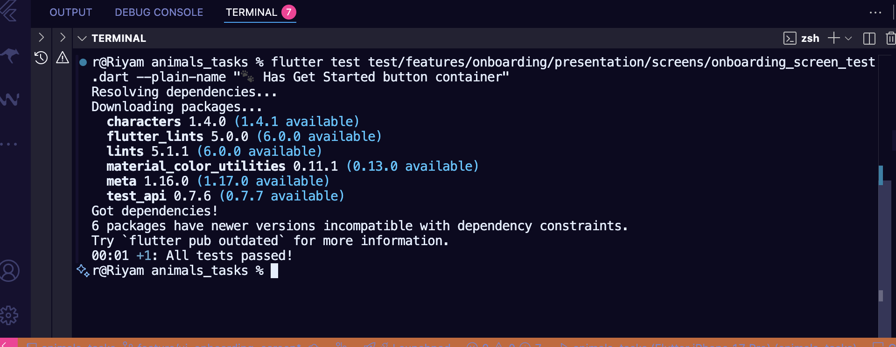

# 🐾 Onboarding Screen Report

## 📋 Overview

This report documents the design, implementation, and testing of the **Onboarding Screen** feature for the *Animals Tasks* Flutter project.  
The screen introduces new users to the app and provides an entry point to the main experience.

---

## 🧩 Feature Summary

The **Onboarding Screen** was built using Flutter’s modern UI components and follows clean UI principles.  
It features:

- A welcoming image (`assets/images/onboarding_image.png`)
- Clear title and subtitle text
- A custom “Get Started” button (container-based)
- Smooth navigation to the Home screen using `GoRouter`
- Safe navigation handling when router is missing

---

## 🧱 Folder Structure

lib/
└── features/
└── onboarding/
└── presentation/
└── screens/
└── onboarding_screen.dart

test/
└── features/
└── onboarding/
└── presentation/
└── screens/
└── onboarding_screen_test.dart

docs/
├── onboarding_screen_report.md
└── tests_results_images/
└── onboarding_test_result.png

---

## 🧪 Test Cases Implemented

| # | Test Description | Purpose |
|---|------------------|----------|
| ✅ 1 | **Builds without crashing** | Ensures the screen renders correctly without runtime errors |
| 🖼️ 2 | **Displays onboarding image** | Checks if the onboarding image asset loads properly |
| 📝 3 | **Shows correct title text** | Confirms that the title text is displayed accurately |
| 💬 4 | **Shows correct subtitle text** | Verifies the presence and correctness of the subtitle |
| 🐾 5 | **Has Get Started button container** | Ensures the button (custom container) is visible and includes both icon and text |
| 🎨 6 | **Button uses primary color** | Validates that the container uses the app’s primary color |
| 🚀 7 | **Navigates to Home when tapped** | Tests that tapping the button triggers navigation using `GoRouter` |
| ⚠️ 8 | **Does not crash if GoRouter missing** | Ensures the app safely handles missing routing context |
| 🚫 9 | **Shows error icon if image missing** | Validates fallback UI behavior for missing image assets |

---

## 🧠 Notes on Implementation

- Used **`GestureDetector`  for full control over the button’s design.  
- The test suite follows the **AAA pattern** (Arrange → Act → Assert).  
- Defensive `try/catch` was added to prevent crashes when `GoRouter` isn’t available.  
- The UI adheres to responsive layout and color consistency from `AppColors`.

---

## 🧾 Test Results

All test cases passed successfully ✅  
Below is the screenshot proof of the Flutter test results:

---

## ✅ Conclusion

The onboarding screen is stable, visually consistent, and fully covered by widget tests — ensuring reliable user onboarding and smooth navigation flow within the app.

---
