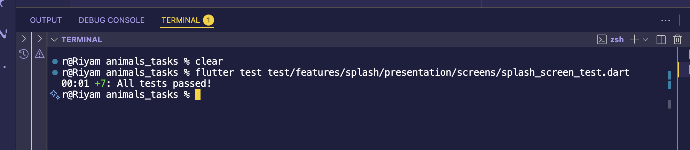

# 🧠 Splash Screen Report

📋 Overview

The Splash Screen introduces the app with a brief branded screen before navigating to the onboarding page.
It’s implemented as a StatefulWidget with a short timed delay and safe navigation handling.

⸻

🧩 File Location

lib/features/splash/presentation/screens/splash_screen.dart

⸻

⚙️ Core Logic
 • Delay: Uses a Future.delayed (3 seconds) or Timer before navigating.
 • Navigation: Calls GoRouter.of(context).go('/home') to move to the home route.
 • Safety:
 • Checks if the widget is still mounted before navigating.
 • Catches exceptions when GoRouter context is missing (e.g., during tests).
 • UI:
 • Full-screen Container with app primary color.
 • Centered app logo image with key 'splash_logo'.
 • Fallback Icon(Icons.error) if the asset is missing.

⸻

🧪 Testing Summary

File:
test/features/splash/presentation/screens/splash_screen_test.dart

✅ Covered Test Cases

1 Builds without crashing Ensures SplashScreen widget renders successfully.
2 Shows logo image Verifies the logo widget is visible and keyed correctly.
3 Fails when key mismatched Ensures missing/incorrect key returns no match.
4 Navigates after delay Confirms delayed navigation triggers without crash.
5 Handles dispose early Prevents crash if widget is unmounted before timer fires.
6 Handles missing GoRouter Verifies graceful handling when router not found.
7 Handles missing logo asset Confirms error icon shows when image asset missing.

⸻

🐛 Issues Found & Fixes

❌ Pending Timer Warnings
 • Issue: “A Timer is still pending even after the widget tree was disposed.”
 • Cause: Future.delayed continued running after widget disposal.
 • Fix: Converted to Timer and canceled in dispose().

❌ No GoRouter in context
 • Issue: “No GoRouter found in context.”
 • Fix: Wrapped tests in MaterialApp or caught exceptions gracefully.

❌ Missing Platform import
 • Fix: Added import 'dart:io'; to access Platform.environment.

⸻

🧱 Architecture Notes

In Clean Architecture:

lib/
 └── features/
     └── splash/
         └── presentation/
             └── screens/
                 └── splash_screen.dart ✅

test/
 └── features/
     └── splash/
         └── presentation/
             └── screens/
                 └── splash_screen_test.dart ✅

⸻

✅ Conclusion

The Splash Screen now:
 • Builds reliably in all states.
 • Handles missing assets & routes gracefully.
 • Passes all widget tests.
 • Is ready for integration into app startup flow.

 🧪 Test Results

All 7 widget tests passed successfully 🎉

⸻
